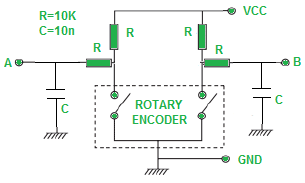

# Rotary-Encoder
Making Close Loop Servo System

Once we play open loop stepper motor system for a while, we will find that lossing steps is an unacceptable problem. We need look at some close loop approach. 

###Feedback Methods

There are few setpoint control options available, such as analog (potentiometer), pluse and direction, PWM, and port commands. More informations can refer to https://granitedevices.com/wiki/Setpoint_signal.

Here, I want to experiencing the rotory encoder, which will provide the pluse and direction type feedback for controlling. The driving motor could use any type of motor, brushed dc motor, stepper motor and brushless motor. 

###Wiring a rotory encoder

A basic rotory encoder will have 4 wires, vcc, gound, A and B. 

 

